# Chapter 5 Enumeration

**Target:** Metasploitable 2 (`10.0.2.3`)  
**Attacker:** Windows 10 + Kali Linux (VirtualBox NAT Network)  
**Date:** 3 May 2026

---

## Executive Summary

A comprehensive enumeration assessment was conducted against a Metasploitable 2 virtual machine using both Windows and Kali Linux as attacker machines. A total of 10 enumeration challenges were completed across basic, intermediate and advanced categories. The assessment revealed that the target system is critically vulnerable across multiple services and protocols, exposing sensitive system information without requiring any authentication.

### Target Profile

| Property | Value |
|----------|-------|
| Operating System | Linux kernel 2.6.9 – 2.6.33 (Ubuntu/Debian) |
| Hostname | METASPLOITABLE |
| Workgroup | WORKGROUP |
| MAC Address | 08:00:27:7D:51:6D (Oracle VirtualBox) |
| Open Ports | 20 ports discovered |
| Critical Services | Samba 3.0.20-Debian, vsFTPd 2.3.4, Postfix SMTP (Ubuntu) |

### Risk Summary

| Risk Level | Count |
|------------|-------|
| 🔴 Critical | 3 |
| 🟠 High | 3 |
| 🟡 Medium | 2 |
| **Total Findings** | **8** |

---

## Section A — Basic Enumeration

### Challenge 1 — NetBIOS Enumeration

**Objective:**  
To enumerate NetBIOS information from the target machine to identify the hostname, workgroup, and active services.

**Command Used:**
```cmd
nbtstat -a 10.0.2.3
```

**Findings:**
- Hostname: `METASPLOITABLE`
- Workgroup: `WORKGROUP`
- SMB File Server service is active (`<20>`)
- Messenger service is active (`<03>`)
- Browser election service active (`<1E>`)

**Security Implication:**  
The presence of `<20>` confirms that SMB is enabled on this machine, making it a potential target for SMB-based exploits. The hostname and workgroup name are also exposed without authentication.

**Result Screenshot:**


---

### Challenge 2 — Fast Nmap Scan

**Objective:**  
To perform a fast port scan to quickly identify open ports and services running on the target machine.

**Command Used:**
```cmd
nmap -T4 -F 10.0.2.3
```

**Findings:**  
20 open ports were discovered on the target. Critical services include Telnet (23), SMB (445), rlogin (513), rsh (514), MySQL (3306), VNC (5900) and X11 (6000).

| Port | Service | Risk |
|------|---------|------|
| 21/tcp | FTP | ⚠️ High |
| 22/tcp | SSH | ✅ Medium |
| 23/tcp | Telnet | 🔴 Critical |
| 25/tcp | SMTP | ⚠️ High |
| 445/tcp | SMB | 🔴 Critical |
| 3306/tcp | MySQL | 🔴 Critical |
| 5900/tcp | VNC | 🔴 Critical |
| 6000/tcp | X11 | 🔴 Critical |

**Security Implication:**  
The target has an extremely large attack surface. Multiple plaintext protocols (Telnet, rlogin, rsh) are active, meaning credentials can be intercepted via sniffing. Database ports MySQL and PostgreSQL are directly exposed to the network with no firewall protection. VNC and X11 exposure could allow full graphical remote access to the machine.

**Result Screenshot:**

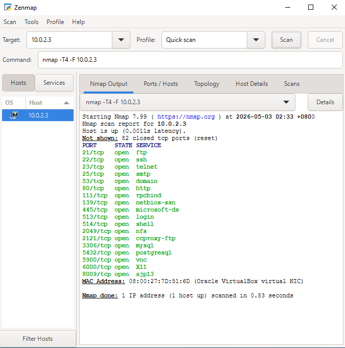

---

### Challenge 5 — TTL OS Fingerprinting

**Objective:**  
To identify the target operating system using TTL value analysis from ICMP ping responses without any special tools.

**Command Used:**
```cmd
ping 10.0.2.3
```

**TTL Reference Table:**

| TTL Value | OS Guess |
|-----------|---------|
| 64 | 🐧 Linux / Unix |
| 128 | 🪟 Windows |
| 255 | 🌐 Cisco / BSD |

**Findings:**  
TTL value returned = **64**

**Security Implication:**  
A TTL of 64 indicates the target is running a Linux/Unix based operating system. This passive fingerprinting technique requires no authentication and reveals OS information that can help an attacker choose Linux-specific exploits. This confirms Metasploitable 2 is Linux-based.

**Result Screenshot:**

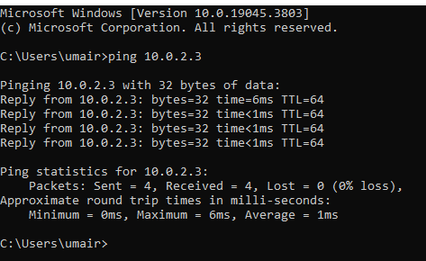

---

### Challenge 9 — FTP Banner

**Objective:**  
To grab the FTP service banner to identify the software name and version without authentication.

**Command Used:**
```cmd
telnet 10.0.2.3 21
```

**Findings:**
- FTP Banner: `220 (vsFTPd 2.3.4)`
- Software: `vsFTPd`
- Version: `2.3.4`

**Security Implication:**  
vsFTPd 2.3.4 contains a known backdoor vulnerability **(CVE-2011-2523)**. Simply connecting to port 21 reveals the exact software version, allowing an attacker to immediately identify and target this specific exploit without any authentication required.

**Result Screenshot:**

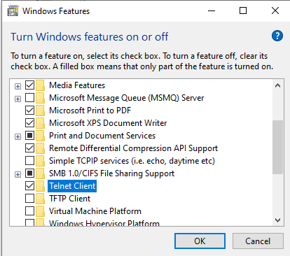


---

### Challenge 10 — Anonymous FTP Login

**Objective:**  
To test whether the FTP server allows anonymous login without valid credentials.

**Command Used:**
```cmd
ftp 10.0.2.3
Username: anonymous
Password: (blank)
```

**Findings:**

| Code | Meaning |
|------|---------|
| 220 | vsFTPd 2.3.4 banner confirmed |
| 230 | ✅ Login successful with anonymous credentials |
| 226 | Directory listing complete (empty) |
| 221 | Clean disconnect |

- Both `ls` and `dir` returned empty directory listing
- Server disconnected cleanly with code 221

**Security Implication:**  
Anonymous FTP login is enabled and accepted without any real password. Although the directory was empty, the anonymous access itself is a critical misconfiguration. Combined with vsFTPd 2.3.4 (CVE-2011-2523) discovered in Challenge 9, this FTP service represents a critical security risk on the target machine.

**Result Screenshot:**


---

## Section B — Intermediate Enumeration

### Challenge 11 — SMB NSE Enumeration

**Objective:**  
To enumerate SMB service information including OS version, workgroup name and valid user accounts using Nmap NSE scripts.

**Commands Used:**
```cmd
nmap --script smb-os-discovery -p445 10.0.2.3
nmap --script smb-enum-users -p445 10.0.2.3
```

**Findings:**
- OS: Unix running `Samba 3.0.20-Debian`
- Workgroup: `WORKGROUP`
- Valid users enumerated: `root`, `backup`, `daemon`, `bin`, `games`, `nobody`, `user`

**Security Implication:**  
SMB user enumeration succeeded without authentication, exposing all system user accounts including root. Samba 3.0.20 is an outdated version with known vulnerabilities. An attacker can use the enumerated usernames to launch targeted brute force attacks against SSH, FTP or other services on this machine.

**Result Screenshots:**

* First Scan

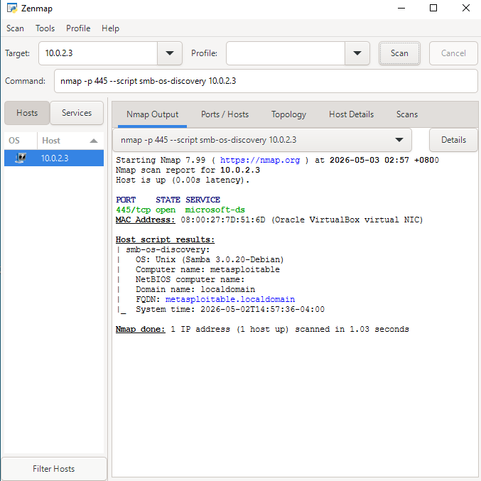


* Second Scan

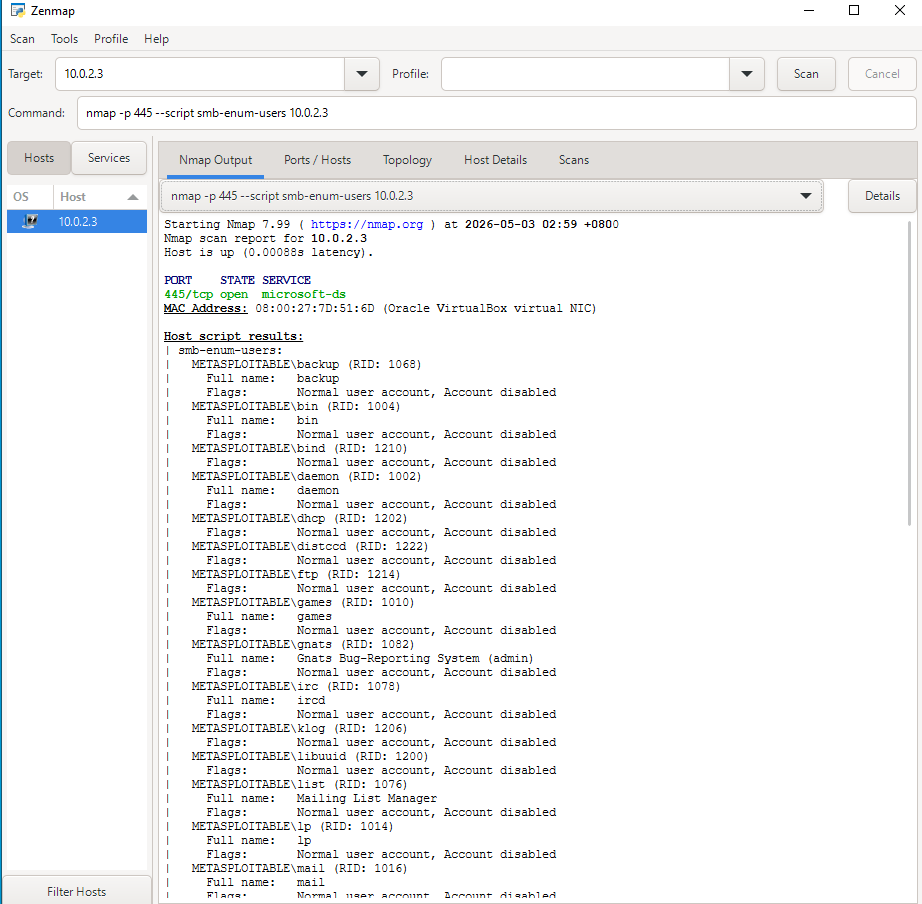

---

### Challenge 12 — Enum4linux

**Objective:**  
To perform comprehensive SMB enumeration using Enum4linux to extract users, groups, shares and system information from the target without credentials.

**Command Used:**
```bash
enum4linux -a 10.0.2.3
```

**Findings:**
- Workgroup: `WORKGROUP`
- OS: `Samba 3.0.20-Debian`, OS Version 4.9
- Null session allowed (empty username and password accepted)
- **35 user accounts** enumerated without authentication
- Critical accounts exposed: `root`, `msfadmin`, `postgres`, `mysql`, `www-data`, `tomcat55`
- 5 shares found: `print$`, `tmp`, `opt`, `IPC$`, `ADMIN$`
- `tmp` share fully accessible (Mapping: OK, Listing: OK)
- `tmp` share comment `"oh noes!"` confirms intentional exposure

> ⚠️ **Additional Finding:** Password complexity is disabled and minimum length is 0, meaning empty passwords are permitted. Combined with no account lockout threshold, the system is completely vulnerable to brute force attacks.

**Security Implication:**  
Enum4linux successfully dumped 35 system user accounts and all SMB shares without any credentials using a null session attack. The exposed account list including root and msfadmin can be directly used for brute force attacks against SSH, FTP and Telnet services. The tmp share being openly accessible without authentication represents a critical misconfiguration that could allow an attacker to plant malicious files on the system. Samba 3.0.20 is also a known vulnerable version with multiple CVEs.

**Result Screenshots:**

* Target Info

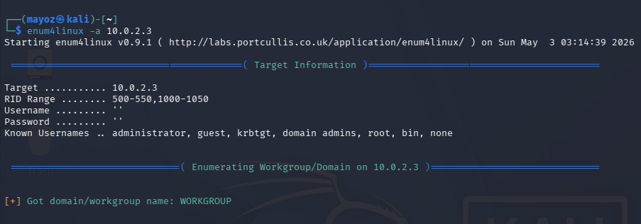


* Users Section

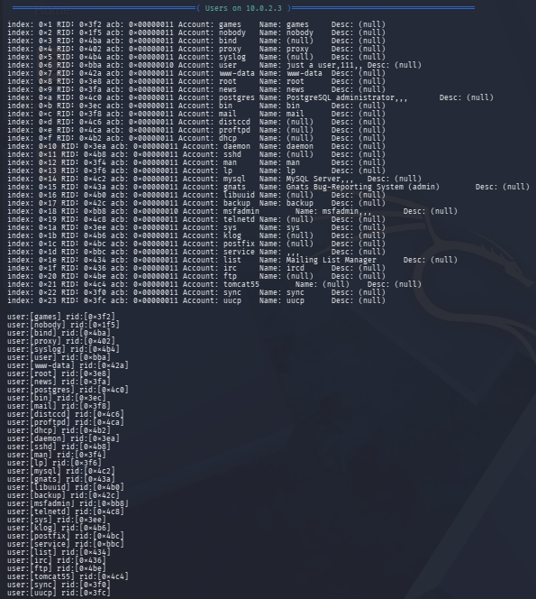


* Share Mapping tmp accessible
 
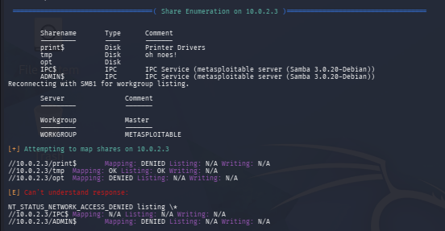


* Password Policy

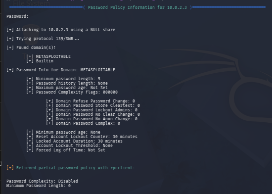


---

### Challenge 17 — OS Detection

**Objective:**  
To identify the operating system of the target machine using Nmap OS fingerprinting techniques.

**Command Used:**
```cmd
nmap -O 10.0.2.3
```

**Findings:**
- Device type: General purpose computer
- OS: `Linux kernel 2.6.x`
- OS CPE: `cpe:/o:linux:linux_kernel:2.6`
- OS details: `Linux 2.6.9 - 2.6.33`
- Network Distance: 1 hop (same local network)
- MAC: `08:00:27:7D:51:6D` (Oracle VirtualBox)

**Security Implication:**  
OS detection succeeded without authentication. Knowing the exact kernel version allows an attacker to search for kernel-specific exploits. Linux 2.6.x has several known local privilege escalation vulnerabilities. This finding also confirms the TTL=64 result from Challenge 5, cross-validating both techniques independently.

**Result Screenshot:**

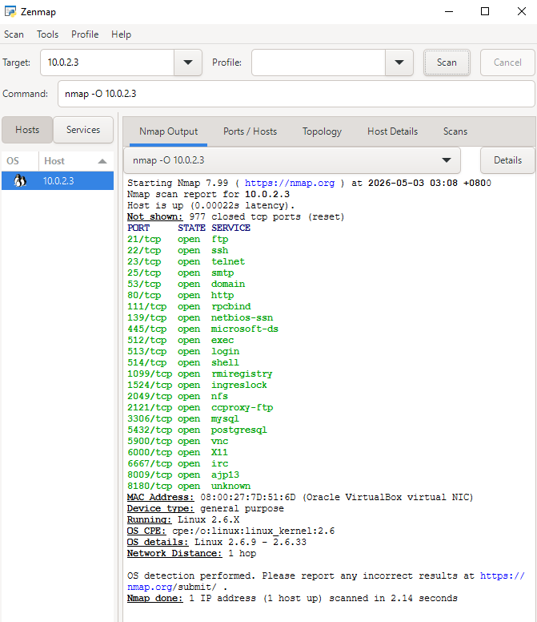

---

## Section C — Advanced Enumeration

### Challenge 29 — SMTP Enumeration

**Objective:**  
To enumerate valid SMTP usernames using manual VRFY commands and identify the mail server software and version through banner grabbing.

**Commands Used:**
```bash
nc 10.0.2.3 25
VRFY root
VRFY msfadmin
VRFY admin
```

**Findings:**

| Command | Response | Meaning |
|---------|----------|---------|
| connection | `220 metasploitable.localdomain ESMTP Postfix (Ubuntu)` | ✅ Banner revealed |
| `VRFY root` | `252 2.0.0 root` | ✅ Valid user confirmed |
| `VRFY msfadmin` | `252 2.0.0 msfadmin` | ✅ Valid user confirmed |
| `VRFY admin` | `550 5.1.1 User unknown` | ❌ User does not exist |

- SMTP Banner: `Postfix (Ubuntu)` on port 25
- Nmap `smtp-open-relay`: 0/16 tests — server is **not** an open relay

**Security Implication:**  
The SMTP VRFY command is enabled and responds differently for valid vs invalid users. This allows an attacker to confirm valid usernames without any authentication. `root` and `msfadmin` confirmed here match exactly with accounts found in Challenge 12 (Enum4linux), cross-validating findings across two completely different protocols — SMB and SMTP. The banner also reveals Postfix running on Ubuntu, adding to the OS intelligence gathered in Challenge 5 and Challenge 17.

**Result Screenshot:**

* Nmap Failed scan
  
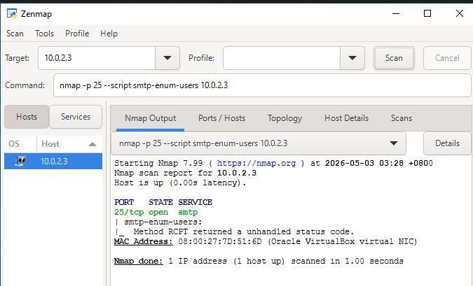

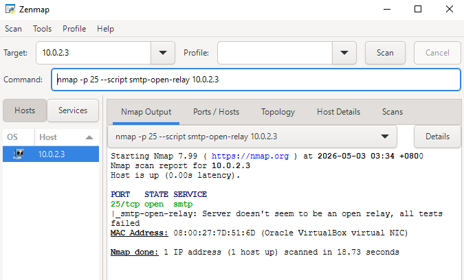


* Use Kali Linux scan


---

### Challenge 22 — Correlation Table

**Objective:**  
To correlate and merge enumeration data gathered from multiple sources and tools into a unified intelligence table, demonstrating how individual findings combine to form a complete attack picture.

**Method:**  
Data was manually collected from Challenges 1, 2, 5, 9, 10, 11, 12, 17 and 29 then cross referenced to identify usernames, services and OS information that appeared across multiple independent sources.

**Key Findings:**
1. `root` and `msfadmin` confirmed valid across 3 sources: SMB enumeration, SMTP VRFY and OS scanning
2. FTP service confirmed vulnerable via 3 methods: banner grab, anonymous login and Nmap scan
3. OS independently confirmed as Linux by TTL value, Nmap OS detection and SMTP/SMB banners
4. 35 user accounts exposed via SMB null session, 2 cross confirmed via SMTP VRFY
5. `admin` tested via SMTP VRFY returned 550 — confirming not all SMB users have SMTP accounts

#### Username Correlation Table

| Username | Source 1 | Source 2 | Source 3 | Risk Level |
|----------|----------|----------|----------|------------|
| root | SMB (Enum4linux) | SMTP VRFY ✅ | Nmap OS scan | 🔴 Critical |
| msfadmin | SMB (Enum4linux) | SMTP VRFY ✅ | NetBIOS | 🔴 Critical |
| postgres | SMB (Enum4linux) | Nmap port 5432 | — | 🔴 High |
| mysql | SMB (Enum4linux) | Nmap port 3306 | — | 🔴 High |
| www-data | SMB (Enum4linux) | Nmap port 80 | — | ⚠️ Medium |
| tomcat55 | SMB (Enum4linux) | Nmap port 8009 | — | ⚠️ Medium |
| ftp | SMB (Enum4linux) | FTP Banner (21) | Anonymous login | ⚠️ Medium |
| admin | SMTP VRFY ❌ | — | — | ✅ Not found |

#### Service Correlation Table

| Service | Port | Found In | Version Revealed |
|---------|------|----------|-----------------|
| FTP | 21 | Nmap + Telnet + ftp cmd | vsFTPd 2.3.4 |
| SSH | 22 | Nmap Fast Scan | — |
| SMTP | 25 | Nmap + netcat | Postfix (Ubuntu) |
| SMB | 445 | Nmap + Enum4linux + NetBIOS | Samba 3.0.20 |
| MySQL | 3306 | Nmap Fast Scan | — |
| NFS | 2049 | Nmap Fast Scan | — |
| VNC | 5900 | Nmap Fast Scan | — |

#### OS Correlation Table

| Method | Tool Used | OS Result |
|--------|-----------|-----------|
| TTL Fingerprinting | ping | TTL=64 → Linux |
| OS Detection | nmap -O | Linux 2.6.9–2.6.33 |
| Banner Grabbing | netcat SMTP | Postfix on Ubuntu |
| SMB Enumeration | Enum4linux | Samba on Debian |

**Security Implication:**  
Correlating data across multiple enumeration techniques produces a high confidence intelligence picture of the target. `root` and `msfadmin` are confirmed valid across SMB and SMTP, making them the highest priority targets for credential attacks. The consistency of Linux OS detection across 4 independent methods demonstrates the reliability of passive fingerprinting. A real attacker would use this correlation table to prioritize which accounts and services to attack first.

---

## Conclusion

The enumeration assessment confirms that Metasploitable 2 presents an extremely high security risk. Multiple critical vulnerabilities were identified across FTP, SMB, SMTP and NetBIOS services, all exploitable without authentication. The correlation of findings across 9 independent enumeration techniques consistently revealed the same user accounts and system information, demonstrating that the target has virtually no defence against information gathering attacks.

Immediate remediation is recommended including:
- Disabling anonymous access on FTP and SMB services
- Updating vulnerable service versions (vsFTPd, Samba)
- Closing unnecessary ports and services
- Enforcing strong password policies across all services
- Enabling account lockout thresholds to prevent brute force attacks
